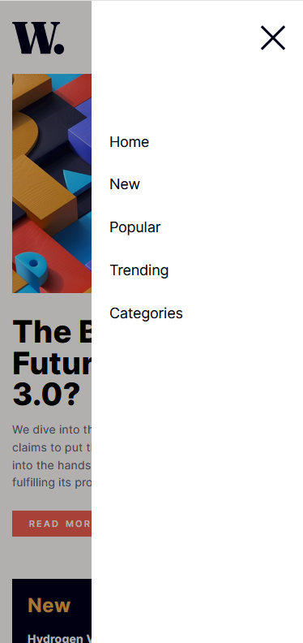

# Responsive News homepage with animated sidebar

## Overview

### The challenge

Users should be able to:

- View the optimal layout for the interface depending on their device's screen size
- See hover and focus states for all interactive elements on the page

### Screenshot

### Links

- Solution URL:  https://github.com/TANJIRWEBDEV/Responsive_news_homepage
- Live Site URL: https://tourmaline-bienenstitch-4284ff.netlify.app/

## My process

### Built with

- Semantic HTML5 markup
- CSS custom properties
- Flexbox
- CSS Grid
- [React](https://reactjs.org/) - JS library

## Author

- Website - https://github.com/TANJIRWEBDEV
- Frontend Mentor - https://www.frontendmentor.io/profile/TANJIRWEBDEV
- Twitter - https://twitter.com/TanWevDev
